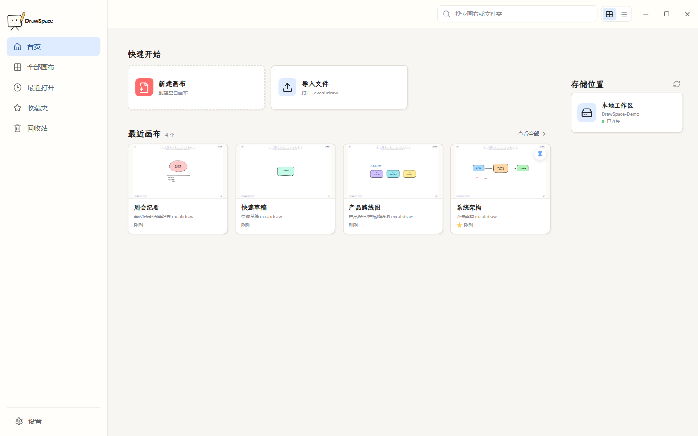
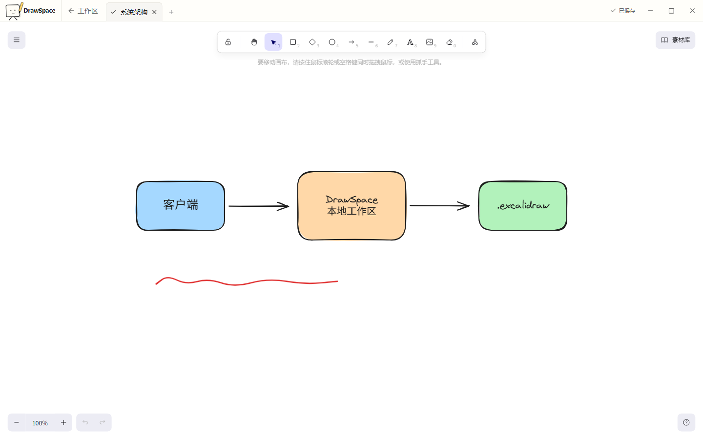
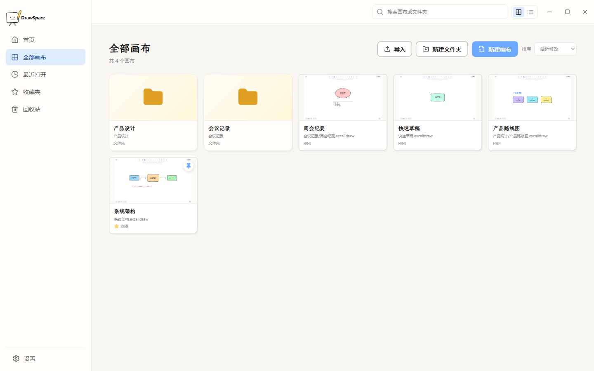
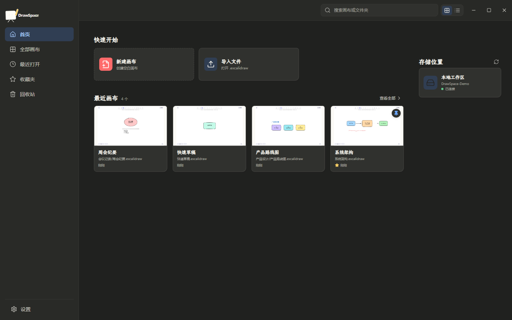
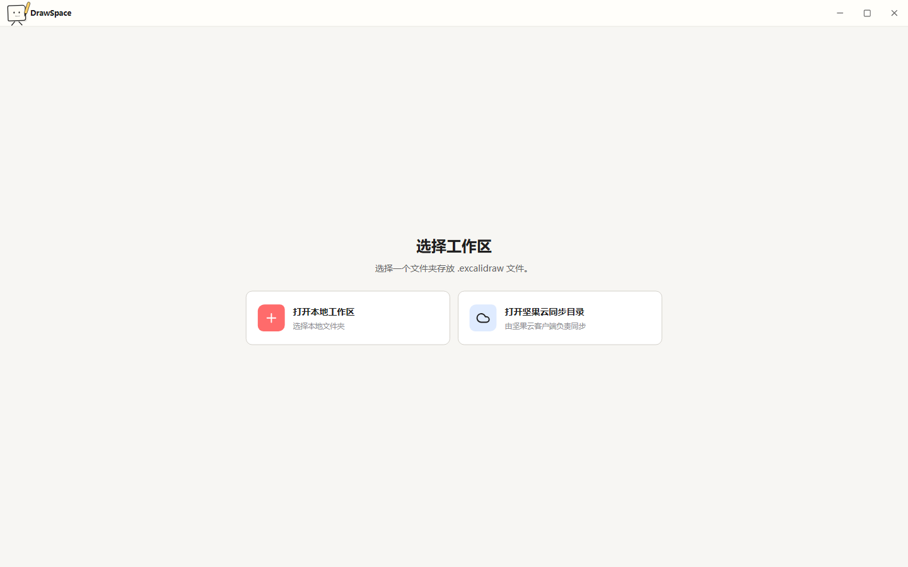

# DrawSpace

[](https://github.com/Nicander93/DrawSpace/actions/workflows/ci.yml)
[](https://github.com/Nicander93/DrawSpace/releases)
[](LICENSE)

DrawSpace 是一款基于 Electron 和 Excalidraw 的本地桌面画布管理工具。它以用户选择的本地目录作为工作区，提供画布管理、搜索、回收站和可靠保存能力，画布内容不会上传到远程服务器。

## AI 图表功能

DrawSpace V1 支持将自然语言交给本地 OpenAI-Compatible 模型生成 Mermaid，再转换为可编辑的 Excalidraw 元素。模型请求只发生在主进程，Renderer 不直接访问模型服务。

支持的模型服务：

- LM Studio：`http://127.0.0.1:1234/v1`
- Ollama OpenAI-Compatible API：`http://127.0.0.1:11434/v1`

在“设置 → AI 图表”中填写服务地址和模型名称，先测试连接再保存。编辑器顶部的“AI 生成图表”按钮支持从零生成；存在选区时可勾选“参考当前选区”，只会发送选中元素的文字与箭头关系摘要，不会发送整个画布、图片、文件路径或工作区内容。生成结果会先预览，确认后以真实可编辑元素插入画布，并沿用现有自动保存与撤销机制。

当前仅支持 Mermaid 路线，适合流程图、时序图、类图、状态图和 ER 图。9B 模型可能产生 Mermaid 语法或语义错误，解析失败时可使用一次“AI 修复”。图表过大时应缩小需求范围。若服务地址配置为远程地址，用户输入和明确选择的选区摘要可能离开本机。

> DrawSpace 是第三方开源项目，与 Excalidraw 官方团队不存在隶属或授权关系。

## 界面预览

工作区首页，支持最近画布、收藏和本地存储状态：



内嵌 Excalidraw 编辑器，支持多标签与自动保存：



全部画布视图，可按文件夹组织，并切换卡片/列表：



深色主题：



首次启动时选择工作区目录：



## 功能

- 选择本地文件夹作为工作区，递归索引 `.excalidraw` 文件
- 新建、打开、重命名、移动、复制、收藏、搜索和删除画布
- 卡片/列表视图、最近打开、排序、分页和多标签编辑
- 自动保存、串行保存、外部修改检测、冲突副本和异常恢复
- 回收站、恢复、永久删除和清空回收站
- 内嵌 Excalidraw 编辑器，支持 PNG、SVG 和 Excalidraw 文件导出
- 浅色、深色和跟随系统主题
- Windows 自定义标题栏、托盘和 NSIS 安装程序

## 下载与安装

前往 [GitHub Releases](https://github.com/Nicander93/DrawSpace/releases) 下载最新的 `DrawSpace-版本号-x64.exe`。

目前提供 Windows 10/11 x64 安装程序。安装包尚未进行商业代码签名，Windows 可能显示“未知发布者”或 SmartScreen 提示，请仅从本项目 Releases 页面下载。

## 快速开始

1. 安装并启动 DrawSpace。
2. 选择一个本地文件夹作为工作区。
3. 新建画布，或打开工作区内已有的 `.excalidraw` 文件。
4. 编辑内容会自动保存到所选工作区。

## 数据与隐私

画布正文始终保存在用户选择的工作区：

```text
<workspace>/
  *.excalidraw
  .drawspace/
    workspace.json
    trash/
```

SQLite 数据库、缩略图、日志和恢复快照保存在 Electron 的 `userData` 目录。在 Windows 上通常位于 `%APPDATA%/DrawSpace/`，实际路径由 `app.getPath("userData")` 决定。

DrawSpace 不包含遥测，不会主动上传画布内容、文件名、路径、图片或凭证。若将工作区放在同步盘目录中，跨设备同步由对应的本地同步客户端完成。

## 常见问题

### Windows 提示未知发布者

当前安装程序未进行商业代码签名，因此 Windows 可能显示安全提示。请核对下载地址来自本项目 GitHub Releases 页面。

### 如何备份或迁移数据

备份整个工作区即可保存画布正文和工作区配置。若需要同时迁移缩略图、恢复记录等本机状态，还应备份 DrawSpace 的 `userData` 目录。

### 工作区可以放在同步盘中吗

可以。DrawSpace 只读写本地目录，同步由同步盘客户端负责。多台设备同时修改同一画布时，应先确认文件已完成同步，以降低冲突概率。

## 从源码运行

环境要求：

- Node.js 22
- npm 10 或更高版本
- Windows 10/11 是主要运行和打包平台；Linux/macOS 可用于开发

安装依赖并启动开发环境：

```bash
npm ci
npm run dev
```

## 检查与测试

```bash
npm run typecheck
npm test
npm run lint
```

`tests/unit/` 存放单元测试，`tests/integration/` 存放服务与数据库集成测试，`tests/e2e/` 存放 Playwright 端到端测试。运行 Electron E2E 测试：

```bash
npm run test:e2e
```

## 构建

生成应用代码：

```bash
npm run build
```

在 Windows 上生成 NSIS x64 安装程序：

```powershell
npm run package:win
```

打包产物位于 `release/`，该目录不会提交到 Git。打包前请退出正在运行的已打包应用，避免文件扫描器或安装程序进程锁定 `app.asar`。

## 发布新版本

项目通过 `v*` 格式的 Git Tag 自动创建 GitHub Release。维护者应先更新版本号并完成检查：

```powershell
npm version patch
npm run typecheck
npm test
npm run lint
git push origin main
git push origin --tags
```

工作流会在 Windows 环境构建安装程序、生成 SHA-256 校验文件并上传到对应 Release。详细流程见 [CONTRIBUTING.md](CONTRIBUTING.md)。

## 参与贡献

欢迎提交 Issue 和 Pull Request。开始前请阅读 [贡献指南](CONTRIBUTING.md) 与 [安全策略](SECURITY.md)。

## 开源协议

本项目使用 [MIT License](LICENSE)。Excalidraw 及其他第三方依赖遵循各自的开源协议。
